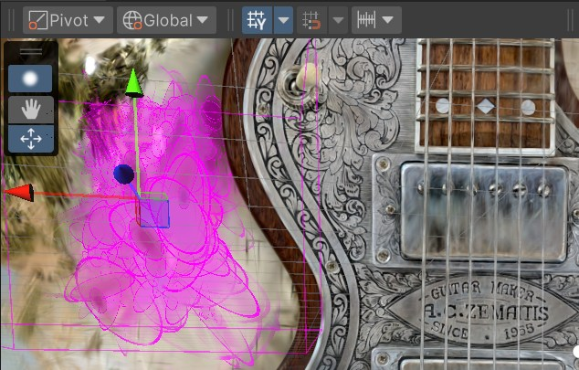
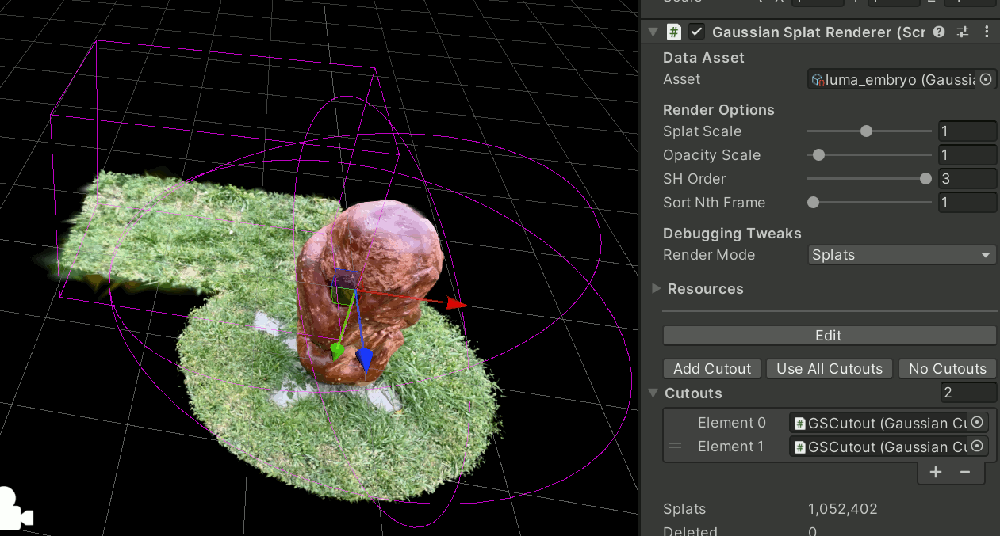

## Editing Gaussian Splats

There is some tooling for "editing" Gaussian Splats. With `GaussianSplatRenderer` object selected,
the inspector shows options to manually edit the splats, as well as create "cutout" objects.

If you have edited the splats, or have created any cutout objects, there's `Export modified PLY`
button in the inspector to export the result back into regular Gaussian Splat `.ply` file. That file
can be used in any other gaussian splat application, or imported into this same Unity project.
When exporting, there's an option to export in world space, which means the splat Transform
position, rotation and scale will get "baked" into the exported PLY splat (including proper
rotation of spherical harmonics).

> Note that for any sort of editing, it is advisable to use "Very High" quality preset when importing
> original gaussian splat file. Otherwise you'll be editing already quantized / approximated
> lossy representation.

### Manual splat editing

By pressing "Edit" button in the inspector, or the splat edit tool in the scene view toolbar ("blob"
icon atop of editing tools),
you can go into manual splat selection mode, that works very similar to other rectangle selection
tools in Unity:
- Click-drag in the scene view selects the splats in the rectangle.
- Shift-drag adds to the current selection, Ctrl-drag removes from selection.
- `Backspace` or `Delete` key deletes selected splats.
- `Ctrl/Cmd+I` inverts selection, `Ctrl/Cmd+A` selects all splats.
- `F` frames view on the selected splats.
- Move (`W`) tool allows moving selected splats in space.

Note that **there is no Undo** for these editing operations. They all are implemented on the GPU, and
making *that* work with Unity's undo system might be doable, but a bit of a hassle. A workaround
is like "revert all edits" functionality, by disabling and re-eanbling the `GaussianSplatRenderer`
component.

If you have any Cutout objects (see below), then selection operations properly take them into account.
For example, inverting the selection will *not* select splats that are "cut" by the cutouts.
This means you could temporarily (mis)use cutouts to help with editing: create a box cutout, and
any manual splat editing will be constrained within that box. Then move the box to edit another area,
etc.

### Splat Cutouts

Objects with `GaussianCutout` component on them can be set to "virtually delete" splats within
an area. In the `GaussianSplatRenderer` inspector there's a list of cutout objects affecting
this splat cloud, and some helper buttons to create a new cutout, clear the list, etc.

Each cutout can be in Ellipsoid or Box shape, and the volume of it is controlled
through regular transform position, rotation and scale.

By default, a cutout hides all splats that are outside of it (when multiple cutouts are present,
then a splat is visible if it's inside *any* cutout).

A cutout can have `Invert` toggle turned on, in which case it hides splats that are *inside* of it
(when multiple cutouts are present, then a splat is hidden if it's inside *any* inverted cutout).

### Merging Splats

When you have multiple `GaussianSplatRenderer` objects selected, there's a button in inspector
to Merge them. They will get merged into one, and the rest will get their GameObjects disabled.
The merged splat can be further edited, or exported into PLY format.
