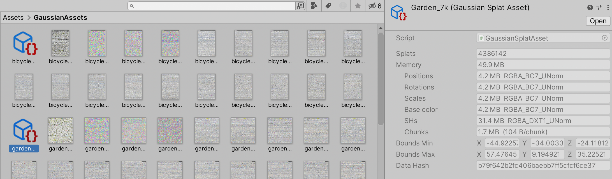

# Toy Gaussian Splatting playground in Unity

SIGGRAPH 2023 had a paper "[**3D Gaussian Splatting for Real-Time Radiance Field Rendering**](https://repo-sam.inria.fr/fungraph/3d-gaussian-splatting/)" by Kerbl, Kopanas, Leimkühler, Drettakis that looks pretty cool!
Check out their website, source code repository, data sets and so on.

I've decided to try to implement the realtime visualization part (i.e. the one that takes already-produced gaussian splat "model" file) in Unity.

The original paper code has a purely CUDA-based realtime renderer; other
people have done their own implementations (e.g. WebGPU at [cvlab-epfl](https://github.com/cvlab-epfl/gaussian-splatting-web), Taichi at [wanmeihuali](https://github.com/wanmeihuali/taichi_3d_gaussian_splatting), etc.).

Code in here so far is randomly cribbled together from reading the paper (as well as earlier literature on EWA splatting), looking at the official CUDA implementation, and so on. Current state:
- The code does **not** use the "tile-based splat rasterizer" bit from the paper; it just draws each gaussian splat as a screenspace aligned rectangle that covers the extents of it.
- Splat color accumulation is done by rendering front-to-back, with a blending mode that results in the same accumulated color as their tile-based renderer.
- Splat sorting is done with a AMD FidelityFX derived radix sort, or (on DX11) with a GPU bitonic sort that is lifted from Unity HDRP codebase.

## Usage

:warning: Note: this is all _**a toy**_, it is not robust, it does not handle errors gracefully, it does not interact or composite well with the "rest of rendering", it is not fast, etc. etc. Also, do not file bugs or issues just yet; I will most likely just ignore them and do whatever I please. I told you so! :warning:

First download or clone this repository and open as a Unity (2022.3) project. Note that the project defaults to DX12 on Windows,
since then it can use a faster sorting routine (DX11 should also work, but sorting will be slower).

Next up, **create some GaussianSplat assets**: open `Tools -> Gaussian Splats -> Create GaussianSplatAsset` menu within Unity. In the dialog point it to
your gaussian splat "model" directory (it is expected to contain `cameras.json` and `point_cloud/iteration_7000/point_cloud.ply` inside of it,
and be an actual Gaussian Splat model, not something else).

Pick desired compression options and output folder, and press "Create Asset" button.

If everything was fine, there should be a GaussianSplat asset that has a bunch of data images next to it:

Since the gaussian splat models are quite large, I have not included any in this Github repo. The original
[paper github page](https://github.com/graphdeco-inria/gaussian-splatting) has a a link to
[14GB zip](https://repo-sam.inria.fr/fungraph/3d-gaussian-splatting/datasets/pretrained/models.zip) of their models.

In the game object that has a `GaussianSplatRenderer` script, **point the Asset field to** one of your created assets.
There are various controls on the script to debug/visualize the data, as well as a slider to move game camera into one of asset's camera
locations.

The rendering takes game object transformation matrix into account; the official gaussian splat models seem to be all rotated by about
-160 degrees around X axis, so in the sample scene the object has that rotation on it, and the camera is setup as a child object.

_That's it!_

Wishlist that I may or might not do at some point:
- [x] Make it respect the game object transform
- [ ] Make rendering faster (actual tiled compute shader rasterizer)
- [ ] Look at ways to make the data sets smaller (both on-disk and in-memory)
- [x] Integrate better with "the rest" of rendering that might be in the scene (BiRP)
- [ ] Maybe look at making it work in URP/HDRP? Not sure yet
- [x] Make sorting faster (bitonic -> FidelityFX radix sort)

## Write-ups

My own blog posts about all this _(so far... not that many!)_:
* [Gaussian Splatting is pretty cool!](https://aras-p.info/blog/2023/09/05/Gaussian-Splatting-is-pretty-cool/) (2023 Sep)
* [Making Gaussian Splats smaller](https://aras-p.info/blog/2023/09/13/Making-Gaussian-Splats-smaller/) (2023 Sep)

## Performance numbers:

"bicycle" scene from the paper, with 6.1M splats and first camera in there, rendering at 1200x800 resolution:
* Windows (NVIDIA RTX 3080 Ti):
  * Official SBIR viewer: 7.4ms (135FPS). 4.8GB VRAM usage.
  * Unity, DX12 or Vulkan: 13.4ms (75FPS) - 10.1ms rendering, 3.3ms sorting. 2.1GB VRAM usage.
  * Unity, DX11: 21.8ms (46FPS) - 9.9ms rendering, 11.9ms sorting.
* Mac (Apple M1 Max):
  * Unity, Metal: 80.6ms (12FPS) - with FidelityFX GPU sort.
  * Unity, Metal: 108ms (9FPS) - with bitonic GPU sort.

## External Code Used

- [zanders3/json](https://github.com/zanders3/json), MIT license, (c) 2018 Alex Parker.
- "Island" GPU sorting code adapted from [Tim Gfrerer blog post](https://poniesandlight.co.uk/reflect/bitonic_merge_sort/).
- "Ffx" GPU sorting code is [AMD FidelityFX ParallelSort](https://github.com/GPUOpen-Effects/FidelityFX-ParallelSort), ported to Unity by me.
