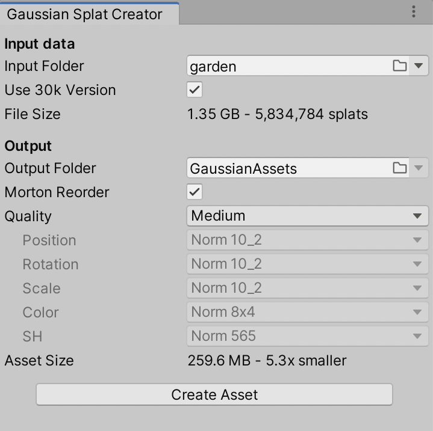

# Toy Gaussian Splatting playground in Unity

SIGGRAPH 2023 had a paper "[**3D Gaussian Splatting for Real-Time Radiance Field Rendering**](https://repo-sam.inria.fr/fungraph/3d-gaussian-splatting/)" by Kerbl, Kopanas, Leimkühler, Drettakis that looks pretty cool!
Check out their website, source code repository, data sets and so on.

I've decided to try to implement the realtime visualization part (i.e. the one that takes already-produced gaussian splat "model" file) in Unity.

The original paper code has a purely CUDA-based realtime renderer; other
people have done their own implementations (e.g. WebGPU at [cvlab-epfl](https://github.com/cvlab-epfl/gaussian-splatting-web), Taichi at [wanmeihuali](https://github.com/wanmeihuali/taichi_3d_gaussian_splatting), etc.).

Code in here so far is randomly cribbled together from reading the paper (as well as earlier literature on EWA splatting), looking at the official CUDA implementation, and so on. Current state:
- The code does **not** use the "tile-based splat rasterizer" bit from the paper; it just draws each gaussian splat as a screenspace aligned rectangle that covers the extents of it.
- Splat color accumulation is done by rendering front-to-back, with a blending mode that results in the same accumulated color as their tile-based renderer.
- Splat sorting is done with a AMD FidelityFX derived radix sort.

## Usage

:warning: Note: this is all _**a toy**_, it is not robust, it does not handle errors gracefully, it does not interact or composite well with the "rest of rendering", it is not fast, etc. etc. Also, do not file bugs or issues just yet; I will most likely just ignore them and do whatever I please. I told you so! :warning:

First download or clone this repository and open as a Unity (2022.3, other versions might also work) project. Note that the project
requires DX12 or Vulkan on Windows, i.e. DX11 will not work.

Next up, **create some GaussianSplat assets**: open `Tools -> Gaussian Splats -> Create GaussianSplatAsset` menu within Unity.
In the dialog, point `Input PLY File` to your Gaussian Splat file. Optionally there can be `cameras.json` next to it or somewhere
in parent folders.

Pick desired compression options and output folder, and press "Create Asset" button. The compression even at "very low" quality setting is decently usable, e.g. 
this capture at Very Low preset is under 8MB of total size (click to see the video): \

If everything was fine, there should be a GaussianSplat asset that has several data files next to it.

Since the gaussian splat models are quite large, I have not included any in this Github repo. The original
[paper github page](https://github.com/graphdeco-inria/gaussian-splatting) has a a link to
[14GB zip](https://repo-sam.inria.fr/fungraph/3d-gaussian-splatting/datasets/pretrained/models.zip) of their models.

In the game object that has a `GaussianSplatRenderer` script, **point the Asset field to** one of your created assets.
There are various controls on the script to debug/visualize the data, as well as a slider to move game camera into one of asset's camera
locations.

The rendering takes game object transformation matrix into account; the official gaussian splat models seem to be all rotated by about
-160 degrees around X axis, and mirrored around Z axis, so in the sample scene the object has such a transform set up.

In the built-in render pipeline, the gaussian splatting should work with no extra steps.
If you are using **URP**, add GaussianSplatURPFeature to the URP renderer settings. If you are using **HDRP**, add
CustomPass volume object and a GaussianSplatHDRPPass entry to it. Maybe also set injection point to "after postprocess"
to stop auto-exposure from going wild.

_That's it!_

Wishlist that I may or might not do at some point:
- [ ] Add some tools to crop / combine splat objects
- [ ] Investigate hashed alpha testing instead of blending (removes need for sorting splats)
- [ ] Make low quality levels work on mobile (look into ASTC texture compression?)
- [ ] Make a C/WebAssembly library to do PLY quantization/compression just like in Unity
- [ ] Make a WebGL/WebGPU example that uses the smaller data files
- [ ] Make rendering faster (actual tiled compute shader rasterizer)
- [x] Make it work in URP and HDRP as well
- [x] Make multiple Gaussian Splat objects in the scene work better
- [x] Make it respect the game object transform
- [x] Look at ways to make the data sets smaller (in memory) ([blog post 1](https://aras-p.info/blog/2023/09/13/Making-Gaussian-Splats-smaller/), [blog post 2](https://aras-p.info/blog/2023/09/27/Making-Gaussian-Splats-more-smaller/))
- [x] Integrate better with "the rest" of rendering that might be in the scene (BiRP)
- [x] Make sorting faster (bitonic -> FidelityFX radix sort)

## Write-ups

My own blog posts about all this:
* [Gaussian Splatting is pretty cool!](https://aras-p.info/blog/2023/09/05/Gaussian-Splatting-is-pretty-cool/) (2023 Sep 5)
* [Making Gaussian Splats smaller](https://aras-p.info/blog/2023/09/13/Making-Gaussian-Splats-smaller/) (2023 Sep 13)
* [Making Gaussian Splats more smaller](https://aras-p.info/blog/2023/09/27/Making-Gaussian-Splats-more-smaller/) (2023 Sep 27)

## Performance numbers:

"bicycle" scene from the paper, with 6.1M splats and first camera in there, rendering at 1200x797 resolution,
at "Medium" asset quality level (283MB asset file):

* Windows (NVIDIA RTX 3080 Ti):
  * Official SBIR viewer: 7.4ms (135FPS). 4.8GB VRAM usage.
  * Unity, DX12 or Vulkan: 12.6ms (79FPS) - 9.4ms rendering, 2.4ms sorting, 0.7ms splat view calc. 1.2GB VRAM usage.
* Mac (Apple M1 Max):
  * Unity, Metal: 31.8ms (31FPS).

Besides the gaussian splat asset that is loaded into GPU memory, currently this also needs about 48 bytes of GPU memory
per splat (for sorting, caching view dependent data etc.).

## External Code Used

- [zanders3/json](https://github.com/zanders3/json), MIT license, (c) 2018 Alex Parker.
- "Ffx" GPU sorting code is [AMD FidelityFX ParallelSort](https://github.com/GPUOpen-Effects/FidelityFX-ParallelSort), ported to Unity by me.
